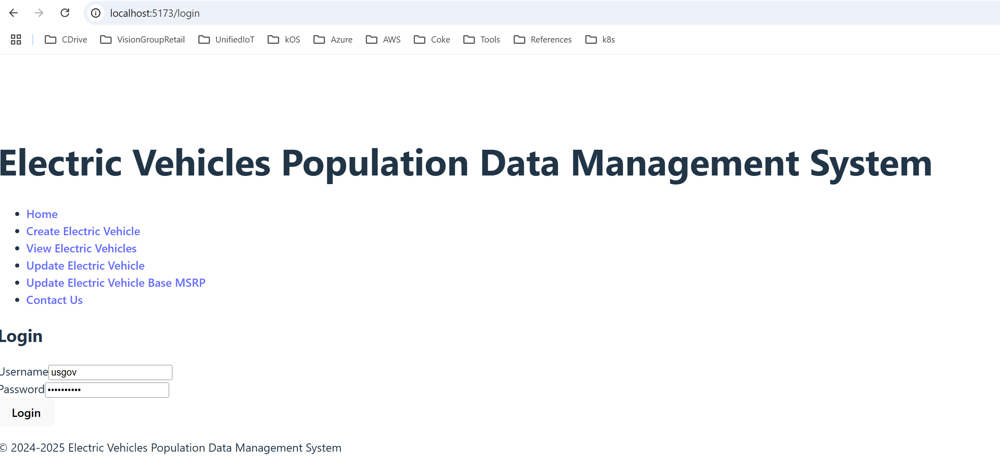

# Spring Boot App 
https://start.spring.io/ Initializr generated spring boot project is enhanced  

# React + TypeScript + Vite
Enhanced the template project generated by 
    npm create vite@latest ev-dms-portal --template react-ts

# Screenshots of running application

